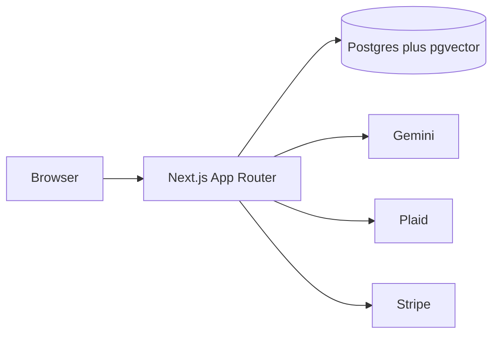

# Architecture

Spendsense is a Next.js App Router app. The browser talks to route handlers. Those handlers read the session, then Postgres. Bank, model, and billing providers sit behind modules that no-op when keys are missing.

Auth.js credentials sessions gate `/dashboard` and the other app pages. Middleware sends anonymous visitors to `/login`.

Seed and batch work (`npm run seed`) categorizes transactions, writes embeddings, detects anomalies, stores savings goals, and writes one or two monthly reports. Request handlers stay small: one vector search, one chat completion, one forecast, or one checkout session.

| Path | Role |
|---|---|
| `app/api/plaid/*` | Link token, exchange, sync |
| `app/api/categorize` | Small uncategorized batch |
| `app/api/rag/search` | Top-k transactions |
| `app/api/copilot` | Grounded answer, free-tier quota |
| `app/api/alerts` | List or recompute anomalies |
| `app/api/forecast` | 30-day cash flow plus narrative |
| `app/api/goals` | List or accept/dismiss |
| `app/api/report` | Monthly health report |
| `app/api/stripe/checkout` | Subscription checkout or mock upgrade |
| `app/api/stripe/webhook` | Raw-body signature, then subscription row |
| `app/api/stripe/portal` | Customer Portal, skipped in mock mode |

Every database statement that reads a person's data includes `user_id` from the session. The webhook is the exception: it maps `metadata.userId` or `stripe_customer_id` onto a user, then writes that row.
