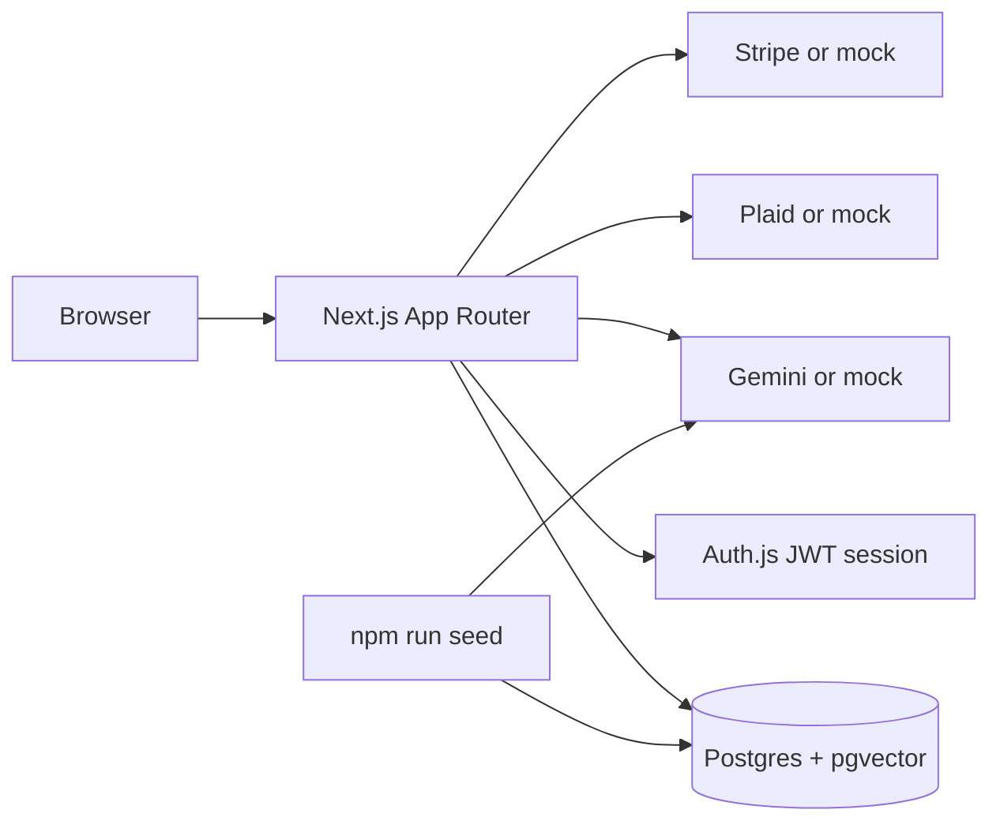
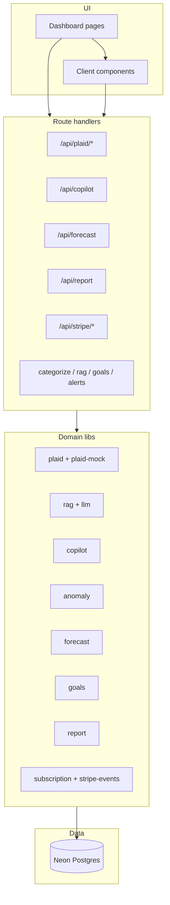

# Architecture

Spendsense is a Next.js App Router application. The browser talks to App Router pages and `app/api/*` route handlers. Handlers read the Auth.js session, then Postgres. Plaid, Gemini, and Stripe sit behind modules that switch to deterministic mock behaviour when their keys are empty.

## Data flow

1. The user signs in with email and password. Auth.js issues a JWT that carries `user.id`.
2. Middleware protects dashboard routes. API handlers call `requireUserId()` and return 401 if the session is missing.
3. Bank link writes accounts and transactions (mock or Plaid). Seed also provisions the demo ledger.
4. Seed (and optional API batches) categorise rows, write embeddings, detect anomalies, recommend goals, and upsert monthly reports.
5. Copilot embeds the question, retrieves top-k rows with `WHERE user_id = $1`, filters by similarity, then narrates or refuses.
6. Billing updates the `subscriptions` row via mock success (no Stripe key) or via signed Stripe webhooks (key present).

## Component diagram

| Layer | Responsibility |
| --- | --- |
| `app/(dashboard)/*` | Server-rendered pages; load session-scoped data |
| `components/*` | Client interactions (connect bank, copilot chat, charts, billing) |
| `app/api/*` | Thin HTTP adapters; auth + zod + call into `lib/` |
| `lib/*` | Business rules, prompts, SQL |
| `scripts/seed.ts` | Heavy batch work kept off the request path |
| `db/migrations/*` | Schema, including `vector(768)` and HNSW |

## API map

| Path | Role |
|---|---|
| `app/api/plaid/*` | Link token, exchange, sync |
| `app/api/categorize` | Small uncategorized batch |
| `app/api/rag/search` | Top-k transactions |
| `app/api/copilot` | Grounded answer, free-tier quota |
| `app/api/alerts` | List or recompute anomalies |
| `app/api/forecast` | 30-day cash flow plus narrative |
| `app/api/goals` | List or accept/dismiss |
| `app/api/report` | Monthly health report |
| `app/api/stripe/checkout` | Subscription checkout or mock upgrade |
| `app/api/stripe/webhook` | Raw-body signature, then subscription row |
| `app/api/stripe/portal` | Customer Portal; skipped in mock mode |

## Key design decisions

1. **Mock-first integrations.** Empty `PLAID_*`, `GEMINI_API_KEY`, and `STRIPE_SECRET_KEY` keep demos and CI green without secrets. The product shape stays the same when keys are added.
2. **Numbers in code, words in the model.** Forecast bands, anomaly z-scores, goal trims, report scores, and action items are TypeScript. Prompts may only restate supplied JSON.
3. **One transaction = one chunk.** Embeddings are row-level so citations are 1:1 with ledger lines and every retrieval query is `user_id`-scoped.
4. **Seed owns heavy work.** Categorisation, embeddings, anomalies, goals, and reports run in `npm run seed` so Vercel Hobby handlers stay under ~10 seconds.
5. **Neon serverless driver.** `@neondatabase/serverless` `Pool` matches Vercel; local Docker Postgres is not used without a WebSocket proxy.
6. **Entitlements from subscription status.** Pro only when stored tier is `pro` and status is `active` or `trialing`. Webhooks (or mock success) write the row; the client does not invent Pro in live Stripe mode.
7. **INR display.** Amounts are formatted with `en-IN` / `INR` for the Indian demo audience; the seeded numeric values are unchanged.

## Security notes

- Every user data query includes `user_id` from the session.
- Exception: Stripe webhook maps `metadata.userId` or `stripe_customer_id`, then writes that user’s row after signature verification.
- Plaid access tokens never leave the server.
- `.env.local` is gitignored; `.env.example` documents names only.

## Related docs

- [RAG pipeline](./rag-pipeline.md)
- [Schema and cosine SQL](./schema.md)
- [Stripe webhooks](./stripe-webhooks.md)
- [Prompt engineering](./prompt-engineering.md)
- [Local setup](./local-setup.md)
- [Demo script](./demo-script.md)
